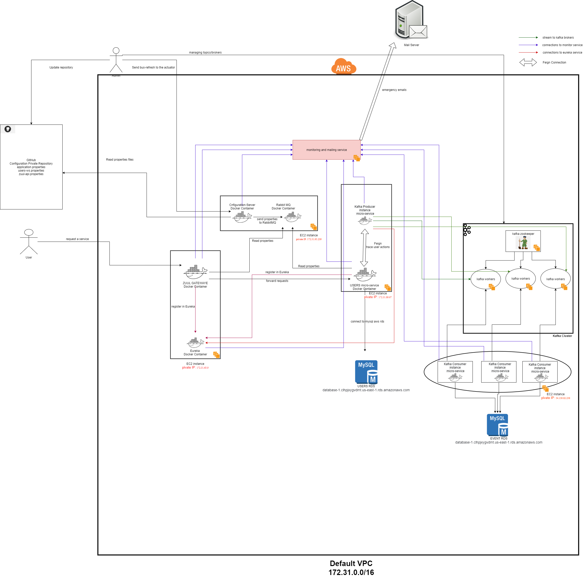
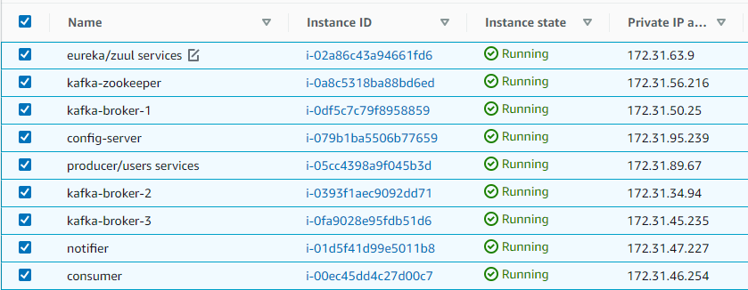

# aws-kafka-docker
<h2>system infranstructure<h2>

  
<h2>Instances Dashboard <h2>

<h3>Kafka configuration</h3>
<ul>
<li>create topic: kafka-topics.bat --create --topic test-5 -zookeeper 54.160.126.51:2181 --replication-factor 3 --partitions 3</li>
<li>kafka-broker-1</li>
  
sudo nano kafka/config/server.properties

  <ul>
  <li>broker.id=0</li>
  <li>listeners=PLAINTEXT://172.31.50.25:9092</li>
  <li>auto.create.topics.enable=false</li>
  <li>log.dirs=/tmp/kafka-logs-0</li>
  <li>zookeeper.connect=172.31.56.216:2181</li>
  </ul>
<li>kafka-broker-2</li>
  
sudo nano kafka/config/server.properties

  <ul>
  <li>broker.id=1</li>
  <li>listeners=PLAINTEXT://172.31.34.94:9092</li>
  <li>auto.create.topics.enable=false</li>
  <li>log.dirs=/tmp/kafka-logs-1</li>
  <li>zookeeper.connect=172.31.56.216:2181</li>
  </ul>
<li>kafka-broker-3</li>
  
sudo nano kafka/config/server.properties

  <ul>
  <li>broker.id=2</li>
  <li>listeners=PLAINTEXT://172.31.45.235:9092</li>
  <li>auto.create.topics.enable=false</li>
  <li>log.dirs=/tmp/kafka-logs-2</li>
  <li>zookeeper.connect=172.31.56.216:2181</li>
  </ul>

</ul>
